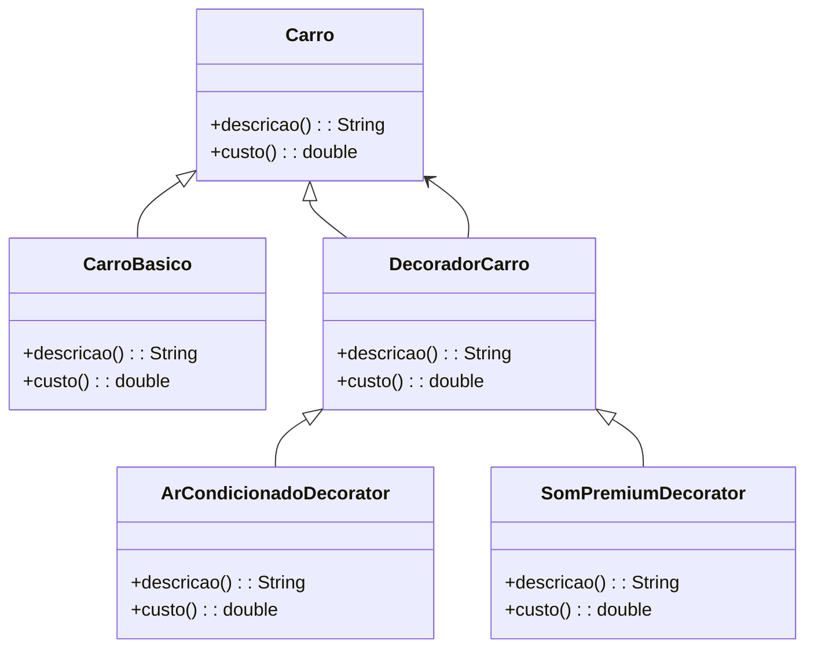

# Decorator Padrão: Adicionando Funcionalidade a Objetos Dinamicamente

## Motivação
O padrão de projeto **Decorator** permite adicionar funcionalidades a um objeto de forma dinâmica, sem modificar sua estrutura original. Ele funciona ao encapsular um objeto dentro de outro, permitindo um número ilimitado de responsabilidades adicionais.

Neste exemplo, utilizamos o **Decorator** para adicionar funcionalidades extras a um carro, como ar-condicionado e sistema de som premium.

---

## UML do Decorator (Mermaid)




## Código do Decorator

### Interface Carro
```java
package decorator;

public interface Carro {
    String descricao();
    double custo();
}
```

### Implementação do Componente Concreto

#### CarroBasico
```java
package decorator;

public class CarroBasico implements Carro {
    @Override
    public String descricao() {
        return "Carro básico";
    }

    @Override
    public double custo() {
        return 20000.0;
    }
}
```

### Implementação do Decorador Base

#### DecoradorCarro
```java
package decorator;

public abstract class DecoradorCarro implements Carro {
    protected Carro carro;

    public DecoradorCarro(Carro carro) {
        this.carro = carro;
    }

    @Override
    public String descricao() {
        return carro.descricao();
    }

    @Override
    public double custo() {
        return carro.custo();
    }
}
```

### Implementação dos Decoradores Específicos

#### ArCondicionadoDecorator
```java
package decorator;

public class ArCondicionadoDecorator extends DecoradorCarro {
    public ArCondicionadoDecorator(Carro carro) {
        super(carro);
    }

    @Override
    public String descricao() {
        return super.descricao() + ", Ar-condicionado";
    }

    @Override
    public double custo() {
        return super.custo() + 2500.0;
    }
}
```

#### SomPremiumDecorator
```java
package decorator;

public class SomPremiumDecorator extends DecoradorCarro {
    public SomPremiumDecorator(Carro carro) {
        super(carro);
    }

    @Override
    public String descricao() {
        return super.descricao() + ", Som Premium";
    }

    @Override
    public double custo() {
        return super.custo() + 1800.0;
    }
}
```

---

## Implementação do Cliente (Main)
```java
package decorator;

public class Main {
    public static void main(String[] args) {
        Carro carroBasico = new CarroBasico();
        Carro carroComAr = new ArCondicionadoDecorator(carroBasico);
        Carro carroCompleto = new SomPremiumDecorator(carroComAr);

        System.out.println("Descrição: " + carroCompleto.descricao());
        System.out.println("Custo total: R$ " + carroCompleto.custo());
    }
}
```

---

## Explicação do Código
1. **Criamos a interface Carro**, que define os métodos `descricao()` e `custo()`.
2. **Implementamos CarroBasico**, que representa um carro padrão sem opcionais.
3. **Criamos o DecoradorCarro**, que encapsula outro `Carro`.
4. **Criamos ArCondicionadoDecorator e SomPremiumDecorator**, que adicionam funcionalidades ao carro sem modificar a classe original.
5. **O cliente pode empilhar os decoradores**, como adicionar ar-condicionado e sistema de som dinamicamente.

---

## Participantes

- **Componente (Carro)**
  - Define a interface para os objetos que podem ter responsabilidades adicionais.

- **Componente Concreto (CarroBasico)**
  - Implementa a interface base sem modificações adicionais.

- **Decorator (DecoradorCarro)**
  - Mantém uma referência ao componente e delega chamadas a ele.

- **Decoradores Concretos (ArCondicionadoDecorator, SomPremiumDecorator)**
  - Adicionam funcionalidade ao objeto dinamicamente.

- **Cliente (Main)**
  - Encapsula um `Carro` dentro de múltiplos decoradores para adicionar funcionalidades.
