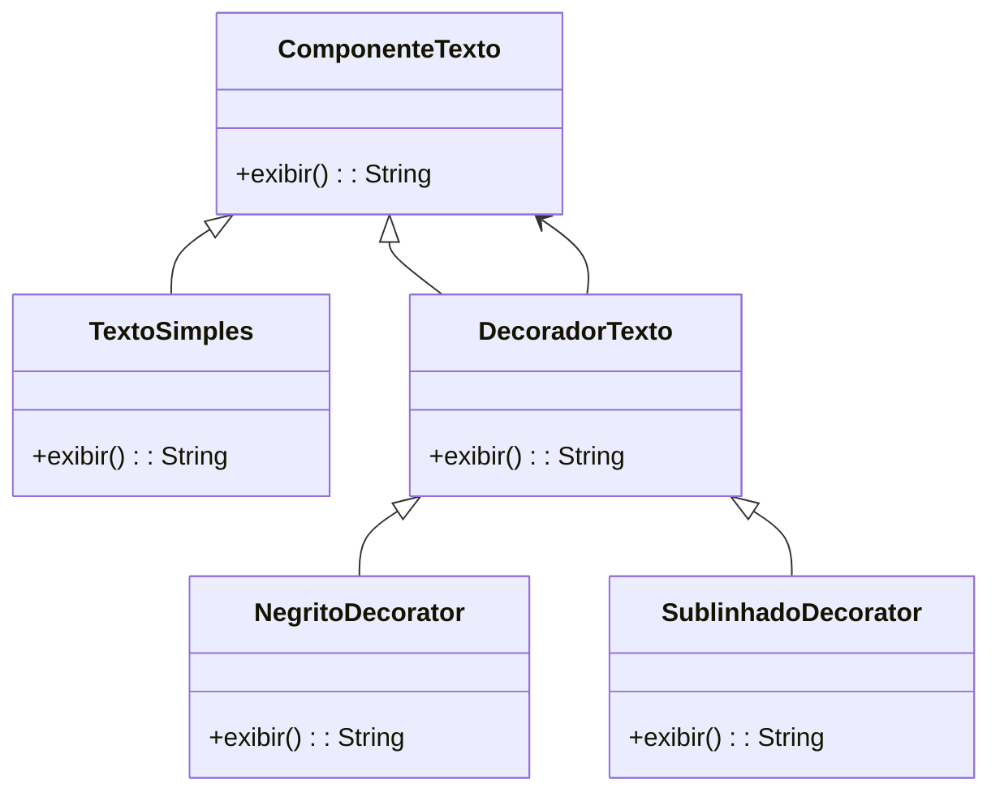

# Decorator Padrão: Adicionando Funcionalidade a Objetos Dinamicamente

## Motivação
O padrão de projeto **Decorator** permite adicionar funcionalidades a um objeto de forma dinâmica, sem modificar sua estrutura original. Ele funciona ao encapsular um objeto dentro de outro, permitindo um número ilimitado de responsabilidades adicionais.

Neste exemplo, utilizamos o **Decorator** para adicionar funcionalidades extras a um componente de texto, como negrito e sublinhado.


## UML do Decorator 



## Código do Decorator

### Interface ComponenteTexto
```java
package decorator;

public interface ComponenteTexto {
    String exibir();
}
```

### Implementação do Componente Concreto

#### TextoSimples
```java
package decorator;

public class TextoSimples implements ComponenteTexto {
    private String texto;

    public TextoSimples(String texto) {
        this.texto = texto;
    }

    @Override
    public String exibir() {
        return texto;
    }
}
```

### Implementação do Decorador Base

#### DecoradorTexto
```java
package decorator;

public abstract class DecoradorTexto implements ComponenteTexto {
    protected ComponenteTexto componente;

    public DecoradorTexto(ComponenteTexto componente) {
        this.componente = componente;
    }

    @Override
    public String exibir() {
        return componente.exibir();
    }
}
```

### Implementação dos Decoradores Específicos

#### NegritoDecorator
```java
package decorator;

public class NegritoDecorator extends DecoradorTexto {
    public NegritoDecorator(ComponenteTexto componente) {
        super(componente);
    }

    @Override
    public String exibir() {
        return "<b>" + super.exibir() + "</b>";
    }
}
```

#### SublinhadoDecorator
```java
package decorator;

public class SublinhadoDecorator extends DecoradorTexto {
    public SublinhadoDecorator(ComponenteTexto componente) {
        super(componente);
    }

    @Override
    public String exibir() {
        return "<u>" + super.exibir() + "</u>";
    }
}
```


## Implementação do Cliente (Main)
```java
package decorator;

public class Main {
    public static void main(String[] args) {
        ComponenteTexto texto = new TextoSimples("Olá, Mundo!");
        ComponenteTexto textoNegrito = new NegritoDecorator(texto);
        ComponenteTexto textoSublinhado = new SublinhadoDecorator(textoNegrito);

        System.out.println(textoSublinhado.exibir());
    }
}
```

## Explicação do Código
1. **Criamos a interface ComponenteTexto**, que define o método `exibir()`.
2. **Implementamos TextoSimples**, que representa um texto básico.
3. **Criamos o DecoradorTexto**, que encapsula outro `ComponenteTexto`.
4. **Criamos NegritoDecorator e SublinhadoDecorator**, que adicionam funcionalidade ao texto sem modificar a classe original.
5. **O cliente pode empilhar os decoradores**, como adicionar negrito e sublinhado dinamicamente.


## Participantes

- **Componente (ComponenteTexto)**
  - Define a interface para os objetos que podem ter responsabilidades adicionais.

- **Componente Concreto (TextoSimples)**
  - Implementa a interface base sem modificações adicionais.

- **Decorator (DecoradorTexto)**
  - Mantém uma referência ao componente e delega chamadas a ele.

- **Decoradores Concretos (NegritoDecorator, SublinhadoDecorator)**
  - Adicionam funcionalidade ao objeto dinamicamente.

- **Cliente (Main)**
  - Encapsula um `ComponenteTexto` dentro de múltiplos decoradores para adicionar funcionalidades.
